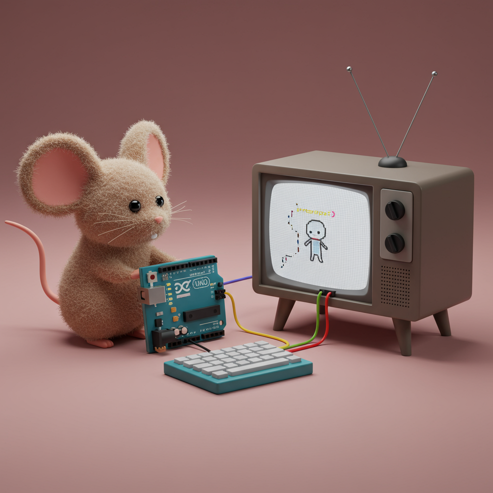
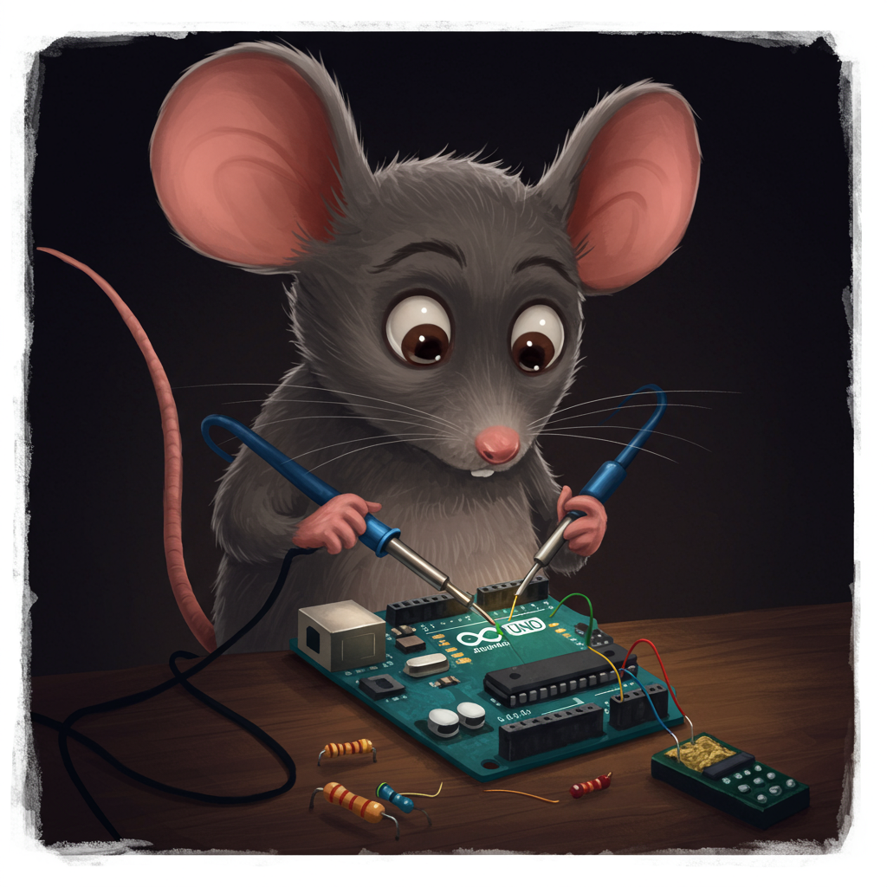
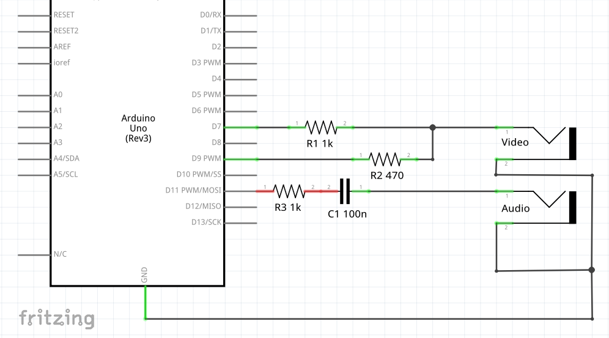
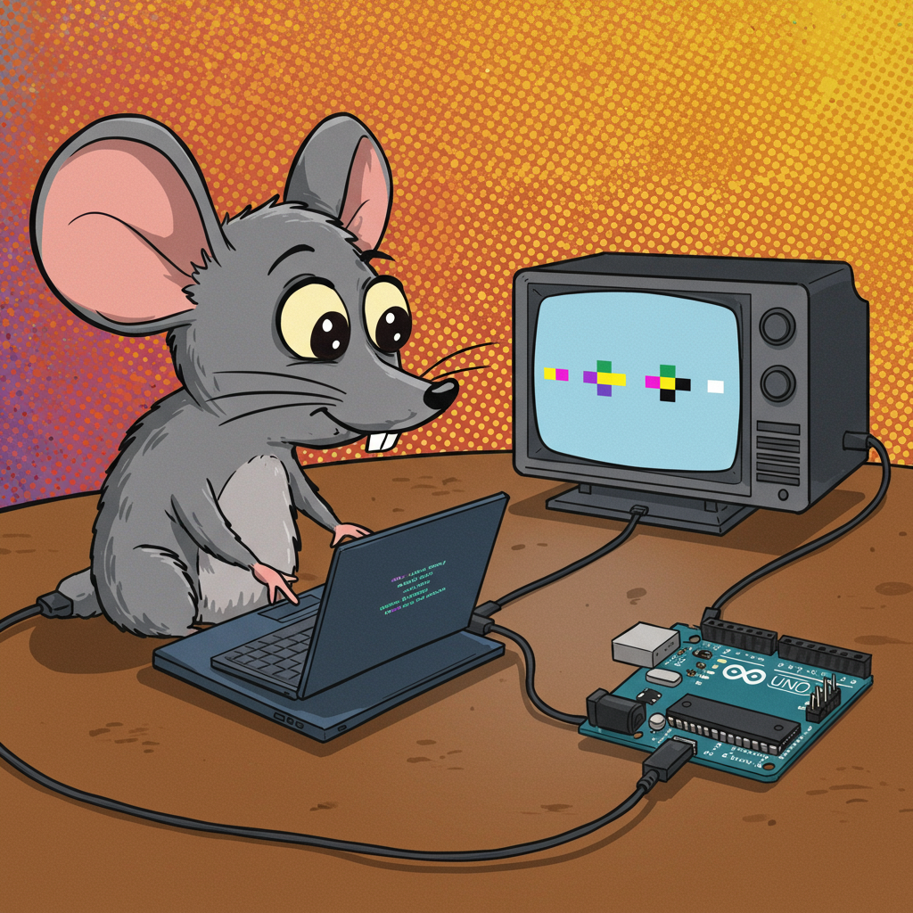
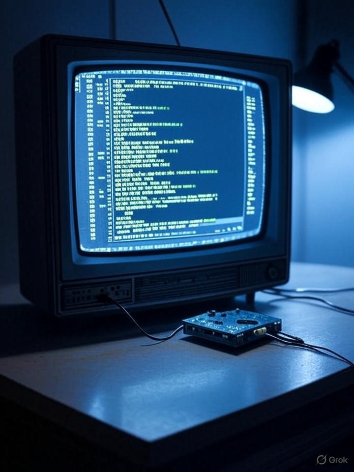
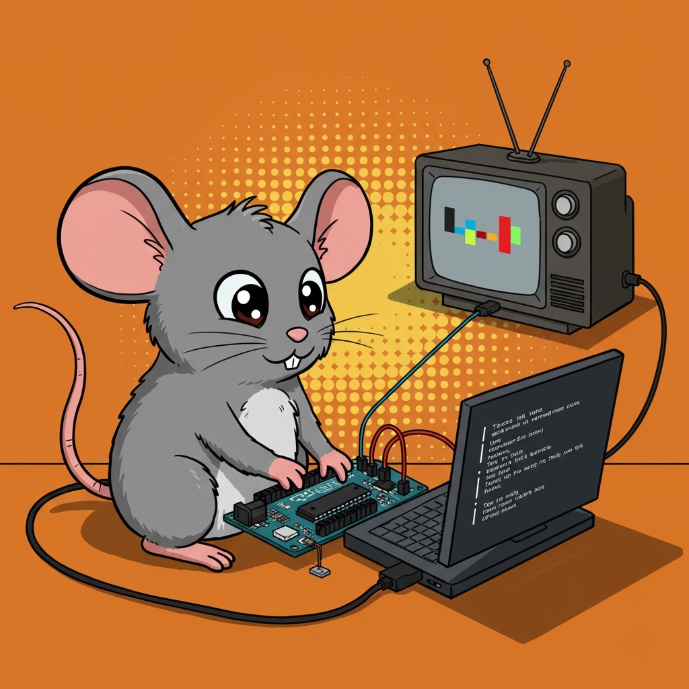

# UNO MOUSE
## A Stack-Based Microcomputer
### for Arduino UNO

  
  
  

🇺🇸 [English](#english) | 🇺🇦 [Українська](#українська)

---

## English

This project implements a simple stack-based programming language (inspired by MOUSE) on an Arduino UNO. It provides a basic interactive environment with a text editor, low-resolution graphics, and program storage in the internal EEPROM.

### About the MOUSE Language

Mouse is a stack-based language using Reverse Polish Notation (RPN), characterized by its minimalist syntax. It was designed for microcomputers with limited resources. Commands are primarily single characters that perform operations on the stack, variables, input/output, control flow, and macros. Mouse was created by Dr. Peter Grogono in the late 1970s and early 1980s, inspired by the MUSYS language used in electronic music studios. Its main purpose was education and operation on resource-constrained devices.

This specific implementation for Arduino UNO aims for a high degree of compatibility with the core concepts and command set of the original MOUSE language, making many original MOUSE examples runnable with minor or no modifications, while adding hardware-specific features like graphics and EEPROM storage. The creator of this Arduino adaptation is Ivan Svarkovsky (2025).

### Features

*   Interpreter for a minimalist stack-based programming language.
*   Built-in line editor for writing and modifying programs directly on the screen.
*   Low-resolution graphics (128x96 pixels) with drawing primitives (pixel, line, circle, rectangle, triangle).
*   Program storage in the internal EEPROM of the Arduino UNO (up to 31 lines of code).
*   Support for PS/2 keyboard input and composite video output (NTSC) via the TVout library.
*   Basic arithmetic, comparison, variable access, and control flow commands.
*   Simple macro system for defining reusable code blocks.
*   Sound feedback for key presses and actions.

### Educational Value

This project serves as an excellent educational tool for understanding:

*   **How stack-based languages work:** By writing and executing code, you directly interact with the stack, gaining insight into this fundamental programming paradigm used in languages like Forth, PostScript, or even virtual machines.
*   **Basic programming concepts in a constrained environment:** Learn how to implement logic, loops, and subroutines using a limited set of commands and memory.
*   **Direct hardware interaction:** Explore how simple commands can directly control graphics output and handle user input at a low level.
*   **Memory limitations and optimization:** The project's design, with its custom compact functions and EEPROM usage, highlights the challenges and techniques for working with limited microcontroller resources.

### Arduino UNO Characteristics

The project is designed for the Arduino UNO, which features:

*   **Microcontroller:** ATmega328P
*   **Clock Speed:** 16 MHz
*   **Flash Memory:** 32 KB (0.5 KB used by bootloader) - *Used for storing the interpreter code.*
*   **SRAM:** 2 KB - *Used for the stack, variables, line buffer, call stack, etc. This is a critical limitation.*
*   **EEPROM:** 1 KB - *Used for storing user programs and macro addresses.*

These limited resources necessitate the highly optimized nature of the UNO MOUSE interpreter and its language design.

### Physical Connections

To connect the necessary peripherals to your Arduino UNO:

*   **PS/2 Keyboard (using PS2uartKeyboard library):**
    *   PS/2 Data Pin -> Arduino Digital Pin 0 (RX)
    *   PS/2 Clock Pin -> Arduino Digital Pin 4
    *   PS/2 5V -> Arduino 5V
    *   PS/2 GND -> Arduino GND
*   **Composite Video Display (NTSC, using TVout library):**
    *   Connect to a **CRT TV** or monitor with a **composite video input**.
    *   Video Signal -> Arduino Digital Pin 7
    *   Sync Signal -> Arduino Digital Pin 9
    *   Video/Sync GND -> Arduino GND
*   **Audio Output (using TVout library):**
    *   Audio Signal -> Arduino Digital Pin 11
    *   Connect to pin 11 through a series-connected resistor (1 kΩ) and a film capacitor (0.1 µF) to your audio input (e.g., speaker or amplifier).

### Building the Project

To build and run this project, you will need:

*   **Hardware:**
    *   Arduino UNO (or a compatible AVR board like Nano, Pro Mini with sufficient memory).
    *   PS/2 Keyboard.
    *   **CRT TV** or monitor with composite video input.
    *   Speaker or amplifier for audio (optional).
    *   Necessary wiring as described above (and potentially a specific circuit for Pin 9 and the audio filter).
*   **Software:**
    *   Arduino IDE **1.8.19** (or potentially other 1.8.x versions, but 1.8.19 is specified).
    *   avr-gcc compiler (version **5.4** is specified, usually included with the recommended IDE version).
*   **Libraries:**
    *   **TVout:** For composite video output and audio. Installable via the Arduino Library Manager.
    *   **PS2uartKeyboard:** For PS/2 keyboard input. Installable via the Arduino Library Manager.

#### Build Steps:

1.  Install the required libraries (TVout, PS2uartKeyboard) via the Arduino IDE Library Manager (`Sketch > Include Library > Manage Libraries...`).
2.  Open the `UNO_MOUSE.ino` file in Arduino IDE 1.8.19.
3.  Select the correct board (`Tools > Board > Arduino Uno`) and port (`Tools > Port`).
4.  **Important Build Flag:** This project was tested with avr-gcc 5.4 and might require disabling Link Time Optimization (LTO) if you encounter compilation or linking errors. In Arduino IDE 1.8.x, LTO is often controlled by the `-flto` flag in the `platform.txt` file for your board. If you face issues, you might need to edit this file (located in your Arduino installation directory under `hardware/arduino/avr/`) and remove or comment out the `-flto` flag from the `compiler.c.flags` and `compiler.cpp.flags` lines. *Be cautious when editing platform files.*
5.  Compile and upload the sketch to your Arduino UNO (`Sketch > Upload`).

### Usage

1.  Connect the PS/2 keyboard, composite video display, and optional audio output to your Arduino UNO.
2.  Power on the Arduino.
3.  The system will boot, play a short melody, and enter the built-in line editor.
4.  Type your program lines. Use the arrow keys (UP, DOWN, LEFT, RIGHT, HOME, END) to navigate and edit. Backspace and Delete work as expected.
5.  Press `Enter` to save the current line to EEPROM and move to the next line.
6.  Type special commands (like `RUN`, `SAV`, `ERS`, `FREERAM`, `TEST`) on a line and press Enter to execute them.
7.  Type `RUN` and press Enter to execute the program stored in EEPROM.
8.  Type `TEST` and press Enter to load and run the built-in example program.

### Command Reference (Brief)

Commands operate on the stack (8-bit signed integers, -128 to 127).

*   **Numbers:** Pushes the number onto the stack.
    *   Syntax: `[number]`
    *   Example: `42`
    *   Stack after: `[42]`
*   **Variables (A-Z):** Pushes the index (0-25) of the variable onto the stack.
    *   Syntax: `[letter]`
    *   Example: `A`
    *   Stack after: `[0]` (if A is the first variable)
*   `.`: **Get variable value**. Takes a variable index from the stack, pushes its value.
    *   Syntax: `[variable_index] .` (or `[letter] .`)
    *   Example: `A .` (if variable A holds value 10)
    *   Stack after: `[10]` (index removed, value added)
*   `+`: **Add**. Takes the top two numbers, adds them, pushes the result.
    *   Syntax: `[number1] [number2] +`
    *   Example: `5 3 +`
    *   Stack after: `[8]` (5 and 3 removed, 8 added)
*   `-`: **Subtract**. Takes the top two numbers, subtracts the top from the second from top, pushes the result.
    *   Syntax: `[number1] [number2] -`
    *   Example: `10 4 -`
    *   Stack after: `[6]` (10 and 4 removed, 6 added)
*   `*`: **Multiply**. Takes the top two numbers, multiplies them, pushes the result.
    *   Syntax: `[number1] [number2] *`
    *   Example: `6 7 *`
    *   Stack after: `[42]` (6 and 7 removed, 42 added)
*   `/`: **Divide (quotient)**. Takes the top two numbers, divides the second from top by the top, pushes the quotient.
    *   Syntax: `[number1] [number2] /`
    *   Example: `20 5 /`
    *   Stack after: `[4]` (20 and 5 removed, 4 added)
*   `\`: **Modulo (remainder)**. Takes the top two numbers, computes the remainder of the second from top divided by the top, pushes the result.
    *   Syntax: `[number1] [number2] \`
    *   Example: `17 5 \`
    *   Stack after: `[2]` (17 and 5 removed, 2 added)
*   `=`: **Assign**. Takes a value and a variable index from the stack, assigns the value to the variable.
    *   Syntax: `[value] [variable_index] =` (or `[value] [letter] =`)
    *   Example: `10 A =`
    *   Stack after: `[]` (10 and index A removed, variable A set to 10)
*   `<`: **Less than**. Takes the top two numbers, pushes `1` if the second from top is less than the top, otherwise `0`.
    *   Syntax: `[number1] [number2] <`
    *   Example: `5 10 <`
    *   Stack after: `[1]` (5 and 10 removed, 1 added)
*   `>`: **Greater than**. Takes the top two numbers, pushes `1` if the second from top is greater than the top, otherwise `0`.
    *   Syntax: `[number1] [number2] >`
    *   Example: `10 5 >`
    *   Stack after: `[1]` (10 and 5 removed, 1 added)
*   `!`: **Print number**. Takes a number from the stack, prints it to the screen.
    *   Syntax: `[number] !`
    *   Example: `42 !`
    *   Stack after: `[]` (42 removed)
    *   Output: `42`
*   `?`: **Input number**. Prompts for input from the keyboard, pushes the entered number onto the stack.
    *   Syntax: `?`
    *   Example: `?` (user enters 123)
    *   Stack after: `[123]`
    *   Output: `? 123` (followed by a newline)
*   `"`: **Print string**. Prints the text enclosed in double quotes. `!` inside the string prints a newline.
    *   Syntax: `"Text"`
    *   Example: `"HELLO!"`
    *   Stack after: `[]` (stack not affected)
    *   Output: `HELLO!`
*   `[` ... `]`: **Conditional block**. Takes a value from the stack. Executes the code inside `[]` if the value is greater than 0.
    *   Syntax: `[condition] [ code ]`
    *   Example: `5 10 < [ "5 is less than 10" ! ]`
    *   Stack after `5 10 <`: `[1]`
    *   Stack after `[` (consumes 1): `[]`
    *   Output: `5 is less than 10`
*   `(` ... `)`: **Loop/Subroutine**. Saves the current position. Executes the code inside `()`. `)` returns execution to the saved position.
    *   Syntax: `( code )`
    *   Example: `( 1 ! )`
    *   Stack after: `[]` (stack not affected by `()`, only by code inside)
    *   Action: Starts loop/call.
*   `^`: **Break/Return**. Takes a value from the stack. Exits the current `()` or `#` block if the value is less than or equal to 0.
    *   Syntax: `[condition] ^`
    *   Example: `( 5 ! 0 ^ )`
    *   Stack after `0`: `[0]`
    *   Stack after `^` (consumes 0): `[]`
    *   Action: Exits the `()` loop.
    *   Output: `5`
*   `$C`: **Macro definition**. `$A code`. Marks the line as a macro definition with name C (A-Z). This is a parser directive, not an executable command during normal run.
    *   Syntax: `$A macro code`
    *   Example: `$M 10 20 + !` (defines macro M)
*   `#C`: **Macro call**. `#A`. Calls macro A. Saves the current position on the call stack.
    *   Syntax: `#A`
    *   Example: `#M` (calls macro M)
    *   Stack after: `[]` (stack not affected by `#`, only by macro code)
    *   Action: Jumps to macro code.
*   `@`: **Macro return**. `@`. Returns from a macro to the position saved by the last `#`.
    *   Syntax: `@`
    *   Example: `@`
    *   Stack after: `[]` (stack not affected)
    *   Action: Returns from macro.
*   `'`: **Comment**. `' text`. Ignores the rest of the line.
    *   Syntax: `' Any text`
    *   Example: `5 ! ' This is a comment`
    *   Stack after: `[]` (stack not affected)
    *   Output: `5`
*   `$$`: **Program end**. `$$`. Stops program execution.
    *   Syntax: `$$`
    *   Example: `1 ! $$ 2 !`
    *   Stack after: `[]` (stack not affected)
    *   Action: Halts program. Output: `1` (2 is not printed)
*   `{`: **Trace on**. `{`. Enables stack tracing (prints stack after most commands).
    *   Syntax: `{`
    *   Example: `{`
    *   Stack after: `[]` (stack not affected)
    *   Action: Enables tracing.
*   `}`: **Trace off**. `}`. Disables stack tracing.
    *   Syntax: `}`
    *   Example: `}`
    *   Stack after: `[]` (stack not affected)
    *   Action: Disables tracing.
*   **Graphics Commands (consume operands from stack):**
    *   `[x] [y] P`: Draw Pixel at (x, y). Stack after: `[]`.
    *   `[x1] [y1] [x2] [y2] L`: Draw Line from (x1, y1) to (x2, y2). Stack after: `[]`.
    *   `[x] [y] [r] C`: Draw Circle at (x, y) with radius r. Uses fill flag. Stack after: `[]`.
    *   `[x] [y] [w] [h] R`: Draw Rectangle at (x, y) with width w and height h. Uses fill flag. Stack after: `[]`.
    *   `[x1] [y1] [x2] [y2] [x3] [y3] T`: Draw Triangle with vertices (x1, y1), (x2, y2), (x3, y3). Stack after: `[]`.
    *   `[value] F`: Set Fill flag. If value is non-zero, enables fill for C and R. If 0, disables. Stack after: `[]`.
    *   `E`: Clear Screen. Stack after: `[]`.
*   **Editor Commands (type on a line and press Enter):**
    *   `RUN`: Execute the program in EEPROM.
    *   `SAV`: Save current line buffer to EEPROM (automatic on Enter/arrow keys). Shows OK.
    *   `ERS`: Erase all program lines and macros from EEPROM.
    *   `FREERAM`: Display available SRAM.
    *   `TEST`: Load and run the built-in test program from Flash.

### License

This project is released under the MIT License. See the source code file (`UNO_MOUSE.ino`) for the full license text.

### Credits

This project is based on the work by Ivan Svarkovsky (2025).

  
  
  

## PS2 Keyboard

| PS2 Pin | Arduino Pin |
|---------|-------------|
| data    | RX (D0)     |
| clock   | XCK (D4)    |
| ground  | Ground      |
| 5V      | 5V          |

## TVout

| TVout Pin | Arduino Pin   |
|-----------|---------------|
| sync      | D9            |
| video     | D7            |
| audio     | D11           |
| ground    | Ground        |

  
  
  

# UNO MOUSE
## Мікрокомп'ютер на Стековій Основі
### для Arduino UNO

  
  
  

🇺🇸 [English](#english) | 🇺🇦 [Українська](#українська)

---

## Українська

Цей проєкт реалізує просту стекову мову програмування (на основі MOUSE) на Arduino UNO. Він надає базове інтерактивне середовище з текстовим редактором, низькороздільною графікою та можливістю зберігання програм у внутрішній EEPROM.

### Про Мову MOUSE

Mouse — це стекова мова, що використовує зворотну польську нотацію (RPN), яка характеризується мінімалістичним синтаксисом. Вона була розроблена для мікрокомп'ютерів з обмеженими ресурсами. Команди в основному представляють собою одиночні символи, що виконують операції над стеком, змінними, вводом/виводом, керуванням потоком та макросами. Mouse був створений доктором Пітером Грогоно наприкінці 1970-х — на початку 1980-х років, натхненний мовою MUSYS, що використовувалася в електронних музичних студіях. Основне призначення — навчання та робота на пристроях з обмеженими ресурсами.

Ця конкретна реалізація для Arduino UNO прагне високого ступеня сумісності з основними концепціями та набором команд оригінальної мови MOUSE, що дозволяє запускати багато оригінальних прикладів MOUSE з незначними змінами або без них, додаючи при цьому апаратно-специфічні можливості, такі як графіка та зберігання в EEPROM. Автором цієї адаптації для Arduino є Іван Сварковський (2025).

### Можливості

*   Інтерпретатор мінімалістичної стекової мови програмування.
*   Вбудований рядковий редактор для написання та редагування програм безпосередньо на екрані.
*   Низькороздільна графіка (128x96 пікселів) з графічними примітивами (піксель, лінія, коло, прямокутник, трикутник).
*   Зберігання програм у внутрішній EEPROM Arduino UNO (до 31 рядка коду).
*   Підтримка вводу з клавіатури PS/2 та композитного відеовиходу (NTSC) через бібліотеку TVout.
*   Базові команди для арифметики, порівняння, доступу до змінних та керування потоком виконання.
*   Проста система макросів для визначення блоків коду, що можуть повторно використовуватись.
*   Звуковий супровід для натискань клавіш та дій.

### Освітня Цінність

Цей проєкт слугує чудовим освітнім інструментом для розуміння:

*   **Принципів роботи стекових мов програмування:** Пишучи та виконуючи код, ви безпосередньо взаємодієте зі стеком, отримуючи уявлення про цю фундаментальну парадигму програмування, що використовується в таких мовах, як Forth, PostScript або навіть віртуальні машини.
*   **Базових концепцій програмування в умовах обмежених ресурсів:** Навчіться реалізовувати логіку, цикли та підпрограми, використовуючи обмежений набір команд та пам'яті.
*   **Безпосередньої взаємодії з апаратним забезпеченням:** Дослідіть, як прості команди можуть безпосередньо керувати виведенням графіки та обробляти ввід користувача на низькому рівні.
*   **Обмежень пам'яті та оптимізації:** Дизайн проєкту, з його власними компактними функціями та використанням EEPROM, підкреслює виклики та техніки роботи з обмеженими ресурсами мікроконтролерів.

### Характеристики Arduino UNO

Проєкт розроблено для Arduino UNO, яка має такі характеристики:

*   **Мікроконтролер:** ATmega328P
*   **Тактова частота:** 16 МГц
*   **Flash-пам'ять:** 32 КБ (0.5 КБ використовується завантажувачем) - *Використовується для зберігання коду інтерпретатора.*
*   **SRAM:** 2 КБ - *Використовується для стеку, змінних, буфера рядка, стеку викликів тощо. Це критичне обмеження.*
*   **EEPROM:** 1 КБ - *Використовується для зберігання програм користувача та адрес макросів.*

Ці обмежені ресурси вимагають високої оптимізації інтерпретатора UNO MOUSE та дизайну його мови.

### Фізичні Підключення

Для підключення необхідної периферії до вашої Arduino UNO:

*   **Клавіатура PS/2 (використовує бібліотеку PS2uartKeyboard):**
    *   Пін даних PS/2 -> Цифровий пін Arduino 0 (RX)
    *   Пін тактування PS/2 -> Цифровий пін Arduino 4
    *   PS/2 5V -> Arduino 5V
    *   PS/2 GND -> Arduino GND
*   **Композитний відеомонітор (NTSC, використовує бібліотеку TVout):**
    *   Підключіть до **ЕПТ телевізора** або монітора з **композитним відеовходом**.
    *   Відеосигнал -> Цифровий пін Arduino 7
    *   Сигнал синхронізації -> Цифровий пін Arduino 9
    *   GND відео/синхронізації -> Arduino GND
*   **Аудіовихід (використовує бібліотеку TVout):**
    *   Аудіосигнал -> Цифровий пін Arduino 11
    *   Підключіть до піну 11 через послідовно з'єднані резистор (1 кОм) та плівковий конденсатор (0.1 мкФ) до вашого аудіовходу (наприклад, динаміка або підсилювача).

### Збірка Проєкту

Для збірки та запуску цього проєкту вам знадобиться:

*   **Апаратне забезпечення:**
    *   Arduino UNO (або сумісна плата на AVR, як Nano, Pro Mini з достатнім обсягом пам'яті).
    *   Клавіатура PS/2.
    *   **ЕПТ телевізор** або монітор з композитним відеовходом.
    *   Динамік або підсилювач для аудіо (опціонально).
    *   Необхідне підключення, як описано вище (та, можливо, специфічна схема для піна 9 та аудіофільтра).
*   **Програмне забезпечення:**
    *   Arduino IDE **1.8.19** (або, можливо, інші версії 1.8.x, але вказано 1.8.19).
    *   Компілятор avr-gcc (вказано версію **5.4**, зазвичай входить до рекомендованої версії IDE).
*   **Бібліотеки:**
    *   **TVout:** Для композитного відеовиходу та аудіо. Можна встановити через менеджер бібліотек Arduino IDE.
    *   **PS2uartKeyboard:** Для вводу з клавіатури PS/2. Можна встановити через менеджер бібліотек Arduino IDE.

#### Кроки збірки:

1.  Встановіть необхідні бібліотеки (TVout, PS2uartKeyboard) через менеджер бібліотек Arduino IDE (`Sketch > Include Library > Manage Libraries...`).
2.  Відкрийте файл `UNO_MOUSE.ino` в Arduino IDE 1.8.19.
3.  Оберіть правильну плату (`Tools > Board > Arduino Uno`) та порт (`Tools > Port`).
4.  **Важливий прапорець збірки:** Цей проєкт був протестований з avr-gcc 5.4 і може вимагати вимкнення оптимізації часу лінкування (LTO), якщо ви зіткнетеся з помилками компіляції або лінкування. У Arduino IDE 1.8.x LTO часто контролюється прапорцем `-flto` у файлі `platform.txt` для вашої плати. Якщо у вас виникнуть проблеми, можливо, вам доведеться відредагувати цей файл (розташований у директорії встановлення Arduino за шляхом `hardware/arduino/avr/`) та видалити або закоментувати прапорець `-flto` з рядків `compiler.c.flags` та `compiler.cpp.flags`. *Будьте обережні при редагуванні системних файлів.*
5.  Скомпілюйте та завантажте скетч на вашу Arduino UNO (`Sketch > Upload`).

### Використання

1.  Підключіть клавіатуру PS/2, композитний відеомонітор та опціональний аудіовихід до вашої Arduino UNO.
2.  Увімкніть живлення Arduino.
3.  Система завантажиться, програє коротку мелодію та увійде у вбудований рядковий редактор.
4.  Вводьте рядки вашої програми. Використовуйте клавіші зі стрілками (ВГОРУ, ВНИЗ, ВЛІВО, ВПРАВО, HOME, END) для навігації та редагування. Backspace та Delete працюють як очікується.
5.  Натисніть `Enter`, щоб зберегти поточний рядок в EEPROM та перейти до наступного рядка.
6.  Вводьте спеціальні команди (наприклад, `RUN`, `SAV`, `ERS`, `FREERAM`, `TEST`) на окремому рядку та натискайте Enter для їх виконання.
7.  Введіть `RUN` та натисніть Enter для виконання програми, збереженої в EEPROM.
8.  Введіть `TEST` та натисніть Enter для завантаження та запуску вбудованої прикладної програми.

### Довідник Команд (Коротко)

Команди працюють зі стеком (8-бітні знакові цілі числа, від -128 до 127).

*   **Числа:** Розміщує число на стек.
    *   Синтаксис: `[число]`
    *   Приклад: `42`
    *   Стек після: `[42]`
*   **Змінні (A-Z):** Розміщує індекс (0-25) змінної на стек.
    *   Синтаксис: `[літера]`
    *   Приклад: `A`
    *   Стек після: `[0]` (якщо A - перша змінна)
*   `.`: **Отримати значення змінної**. Бере індекс змінної зі стеку, розміщує її значення.
    *   Синтаксис: `[індекс_змінної] .` (або `[літера] .`)
    *   Приклад: `A .` (якщо змінна A містить значення 10)
    *   Стек після: `[10]` (індекс видалено, значення додано)
*   `+`: **Додавання**. Бере два верхні числа, додає їх, розміщує результат.
    *   Синтаксис: `[число1] [число2] +`
    *   Приклад: `5 3 +`
    *   Стек після: `[8]` (5 і 3 видалено, 8 додано)
*   `-`: **Віднімання**. Бере два верхні числа, віднімає верхнє від передостаннього, розміщує результат.
    *   Синтаксис: `[число1] [число2] -`
    *   Приклад: `10 4 -`
    *   Стек після: `[6]` (10 і 4 видалено, 6 додано)
*   `*`: **Множення**. Бере два верхні числа, множить їх, розміщує результат.
    *   Синтаксис: `[число1] [число2] *`
    *   Приклад: `6 7 *`
    *   Стек після: `[42]` (6 і 7 видалено, 42 додано)
*   `/`: **Ділення (частка)**. Бере два верхні числа, ділить передостаннє на верхнє, розміщує частку.
    *   Синтаксис: `[число1] [число2] /`
    *   Приклад: `20 5 /`
    *   Стек після: `[4]` (20 і 5 видалено, 4 додано)
*   `\`: **Остача від ділення**. Бере два верхні числа, обчислює остачу від ділення передостаннього на верхнє, розміщує результат.
    *   Синтаксис: `[число1] [число2] \`
    *   Приклад: `17 5 \`
    *   Стек після: `[2]` (17 і 5 видалено, 2 додано)
*   `=`: **Присвоїти**. Бере значення та індекс змінної зі стеку, присвоює значення змінній.
    *   Синтаксис: `[значення] [індекс_змінної] =` (або `[значення] [літера] =`)
    *   Приклад: `10 A =`
    *   Стек після: `[]` (10 та індекс A видалено, змінній A присвоєно 10)
*   `<`: **Менше**. Бере два верхні числа, розміщує `1`, якщо передостаннє менше верхнього, інакше `0`.
    *   Синтаксис: `[число1] [число2] <`
    *   Приклад: `5 10 <`
    *   Стек після: `[1]` (5 і 10 видалено, 1 додано)
*   `>`: **Більше**. Бере два верхні числа, розміщує `1`, якщо передостаннє більше верхнього, інакше `0`.
    *   Синтаксис: `[число1] [число2] >`
    *   Приклад: `10 5 >`
    *   Стек після: `[1]` (10 і 5 видалено, 1 додано)
*   `!`: **Вивести число**. Бере число зі стеку, виводить його на екран.
    *   Синтаксис: `[число] !`
    *   Приклад: `42 !`
    *   Стек після: `[]` (42 видалено)
    *   Вивід: `42`
*   `?`: **Ввести число**. Запитує ввід з клавіатури, розміщує введене число на стек.
    *   Синтаксис: `?`
    *   Приклад: `?` (користувач вводить 123)
    *   Стек після: `[123]`
    *   Вивід: `? 123` (з переходом на новий рядок)
*   `"`: **Вивести рядок**. Виводить текст у подвійних лапках. `!` всередині рядка виводить перехід на новий рядок.
    *   Синтаксис: `"Текст"`
    *   Приклад: `"HELLO!"`
    *   Стек після: `[]` (стек не змінюється)
    *   Вивід: `HELLO!`
*   `[` ... `]`: **Умовний блок**. Бере значення зі стеку. Виконує код всередині `[]` якщо значення більше 0.
    *   Синтаксис: `[умова] [ код ]`
    *   Приклад: `5 10 < [ "5 менше 10" ! ]`
    *   Стек після `5 10 <`: `[1]`
    *   Стек після `[` (споживає 1): `[]`
    *   Вивід: `5 менше 10`
*   `(` ... `)`: **Цикл/Підпрограма**. Зберігає поточну позицію. Виконує код всередині `()`. `)` повертає виконання на збережену позицію.
    *   Синтаксис: `( код )`
    *   Приклад: `( 1 ! )`
    *   Стек після: `[]` (стек не змінюється самою командою `()`, змінюється кодом всередині)
    *   Дія: Починає цикл/виклик.
*   `^`: **Вихід/Повернення**. Бере значення зі стеку. Виходить з поточного блоку `()` або `#`, якщо значення менше або дорівнює 0.
    *   Синтаксис: `[умова] ^`
    *   Приклад: `( 5 ! 0 ^ )`
    *   Стек після `0`: `[0]`
    *   Стек після `^` (споживає 0): `[]`
    *   Дія: Виходить з циклу `()`.
    *   Вивід: `5`
*   `$C`: **Визначення макросу**. `$A код`. Позначає рядок як визначення макросу з іменем C (A-Z). Це директива парсера, не виконувана команда під час звичайного запуску.
    *   Синтаксис: `$A код макросу`
    *   Приклад: `$M 10 20 + !` (визначає макрос M)
*   `#C`: **Виклик макросу**. `#A`. Викликає макрос A. Зберігає поточну позицію в стеку викликів.
    *   Синтаксис: `#A`
    *   Приклад: `#M` (викликає макрос M)
    *   Стек після: `[]` (стек не змінюється самою командою `#`, змінюється кодом макросу)
    *   Дія: Переходить до коду макросу.
*   `@`: **Повернення з макросу**. `@`. Повертається з макросу на позицію, збережену останнім `#`.
    *   Синтаксис: `@`
    *   Пример: `@`
    *   Стек после: `[]` (стек не змінюється)
    *   Дія: Повертається з макросу.
*   `'`: **Коментар**. `' текст`. Ігнорує решту рядка.
    *   Синтаксис: `' Будь-який текст`
    *   Приклад: `5 ! ' Це коментар`
    *   Стек після: `[]` (стек не змінюється)
    *   Вивід: `5`
*   `$$`: **Кінець програми**. `$$`. Зупиняє виконання програми.
    *   Синтаксис: `$$`
    *   Приклад: `1 ! $$ 2 !`
    *   Стек після: `[]` (стек не змінюється)
    *   Дія: Зупиняє програму. Вивід: `1` (2 не виводиться)
*   `{`: **Увімкнути трасування**. `{`. Вмикає трасування стеку (виводить стек після більшості команд).
    *   Синтаксис: `{`
    *   Приклад: `{`
    *   Стек після: `[]` (стек не змінюється)
    *   Дія: Вмикає трасування.
*   `}`: **Вимкнути трасування**. `}`. Вимикає трасування стеку.
    *   Синтаксис: `}`
    *   Приклад: `}`
    *   Стек після: `[]` (стек не змінюється)
    *   Дія: Вимикає трасування.
*   **Команди Графіки (споживають операнди зі стеку):**
    *   `[x] [y] P`: Намалювати Піксель в (x, y). Стек після: `[]`.
    *   `[x1] [y1] [x2] [y2] L`: Намалювати Лінію з (x1, y1) до (x2, y2). Стек після: `[]`.
    *   `[x] [y] [r] C`: Намалювати Коло в (x, y) радіусом r. Використовує прапорець заливки. Стек після: `[]`.
    *   `[x] [y] [w] [h] R`: Намалювати Прямокутник в (x, y) шириною w та висотою h. Використовує прапорець заливки. Стек після: `[]`.
    *   `[x1] [y1] [x2] [y2] [x3] [y3] T`: Намалювати Трикутник з вершинами (x1, y1), (x2, y2), (x3, y3). Стек після: `[]`.
    *   `[значення] F`: Встановити прапорець Заливки. Якщо значення не нульове, вмикає заливку для C та R. Якщо 0, вимикає. Стек після: `[]`.
    *   `E`: Очистити Екран. Стек після: `[]`.
*   **Команди Редактора (вводяться на рядку та натискається Enter):**
    *   `RUN`: Виконати програму з EEPROM.
    *   `SAV`: Зберегти поточний буфер рядка в EEPROM (автоматично при Enter/стрілках). Показує OK.
    *   `ERS`: Стерти всі рядки програми та макроси з EEPROM.
    *   `FREERAM`: Показати доступну SRAM.
    *   `TEST`: Завантажити та запустити вбудовану тестову програму з Flash.

### Ліцензія

Цей проєкт випущено під ліцензією MIT. Повний текст ліцензії дивіться у вихідному файлі (`UNO_MOUSE.ino`).

### Подяки

Цей проєкт базується на роботі Івана Сварковського (2025).

  
  
  
  
  
  

---
